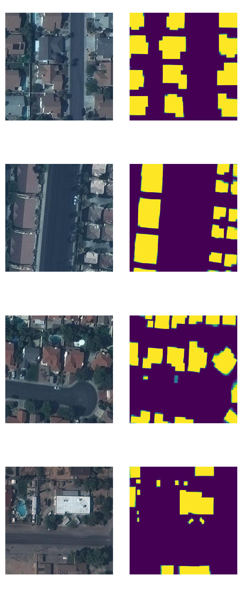

# Segmentation of Satellite Images

## Synopsis

Images are increasingly available from a variety of sources, including nano-satellites, drones and conventional high altitude satellites. The data is available: the task is to produce intervention-specific maps with the relevant features and in a short timeframe. Thus, the goal is to train a model which given a new tile can annotate all buildings.

## Dataset

You can download the [datasets](https://www.crowdai.org/challenges/mapping-challenge) and place them in the data/ dir :

* train.tar.gz : This is the Training Set of 280741 tiles (as 300x300 pixel RGB images) of satellite imagery, along with their corresponding annotations in MS-COCO format

* val.tar.gz: This is the suggested Validation Set of 60317 tiles (as 300x300 pixel RGB images) of satellite imagery, along with their corresponding annotations in MS-COCO format

* test_images.tar.gz : This is the Test Set for Round-1, where you are provided with 60697 files (as 300x300 pixel RGB images) and your are required to submit annotations for all these files.

## Requirements  

* Linux or macOS  
* Python >= 3.6   
* PyTorch 1.3    
* torchvision that matches the PyTorch installation. You can install them together at pytorch.org to make sure of this.   
* OpenCV, needed by demo and visualization   
* fvcore: pip install -U 'git+https://github.com/facebookresearch/fvcore'   
* pycocotools: pip install cython; pip install 'git+https://github.com/cocodataset/cocoapi.git#subdirectory=PythonAPI'  
* GCC >= 4.9  

## How to run

1. Download the dataset and run the preprocessing.py in the src directory.   
2. To train a pretrained model, you can run training.py from the src directory.    
3. For inference, use inference.py script.

## Results

